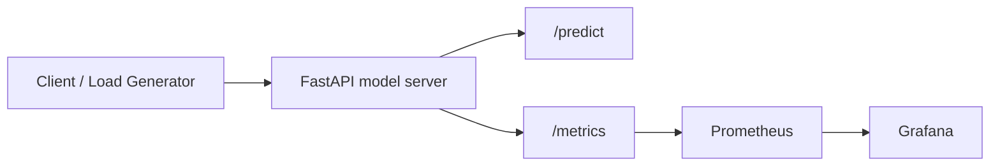

# ML Model Serving Observability

`ML Model Serving Observability` is a technical portfolio project that demonstrates how to expose a machine learning model through an inference API and monitor it with `Prometheus` and `Grafana`.

The repository combines:

- a reproducible model training pipeline;
- a `FastAPI` inference server;
- native Prometheus instrumentation;
- a pre-provisioned Grafana dashboard;
- a local development stack via `docker compose`.

## Problem Statement

Serving a model in production is only one part of the system. To operate an inference service safely, engineering teams usually need observability for:

- request throughput;
- latency percentiles;
- inference error rate;
- prediction distribution;
- confidence behavior over time;
- health and availability of the serving endpoint.

This project demonstrates an end-to-end reference architecture for that operational layer.

## Architecture



## Repository Deliverables

- model training and artifact persistence in [src/model_training.py](src/model_training.py)
- instrumented serving layer in [src/serving.py](src/serving.py)
- technical inspection UI in [app.py](app.py)
- Docker image in [Dockerfile](Dockerfile)
- local observability stack in [docker-compose.yml](docker-compose.yml)
- Prometheus scrape config in [prometheus/prometheus.yml](prometheus/prometheus.yml)
- provisioned Grafana datasource and dashboard under [grafana](grafana)
- automated tests in [tests/test_serving.py](tests/test_serving.py)

## Technical Stack

### Model and serving layer

- `scikit-learn`
- `pandas`
- `joblib`
- `FastAPI`
- `uvicorn`

### Observability layer

- `prometheus_client`
- `Prometheus`
- `Grafana`

### Runtime and packaging

- `Docker`
- `docker compose`
- `pytest`
- `Streamlit`

## Modeling Approach

The project uses the `wine` dataset from `scikit-learn` as a lightweight multi-class classification problem.

### Training pipeline

The training job:

1. loads the dataset;
2. splits it into `train` and `test`;
3. builds a `Pipeline(StandardScaler -> LogisticRegression)`;
4. evaluates `accuracy` and `macro_f1`;
5. persists:
   - the serialized model;
   - training metrics;
   - a sample payload for inference testing;
   - the text classification report.

### Why this model

`LogisticRegression` is intentionally simple here because the goal is not state-of-the-art modeling, but rather a clean serving and observability reference.

## Serving Layer

The inference service is implemented in [src/serving.py](src/serving.py).

### Exposed endpoints

- `GET /health`
  liveness and artifact availability
- `GET /metrics`
  Prometheus-compatible metrics endpoint
- `POST /predict`
  multi-class inference endpoint

### Inference contract

The `POST /predict` endpoint accepts a fully structured feature payload:

- `alcohol`
- `malic_acid`
- `ash`
- `alcalinity_of_ash`
- `magnesium`
- `total_phenols`
- `flavanoids`
- `nonflavanoid_phenols`
- `proanthocyanins`
- `color_intensity`
- `hue`
- `od280_od315_of_diluted_wines`
- `proline`

The response returns:

- `predicted_class`
- `confidence`
- `class_probabilities`
- `latency_ms`

## Prometheus Metrics

The API exports the following custom metrics:

- `model_inference_requests_total`
  total requests by endpoint and status
- `model_inference_latency_seconds`
  histogram for request latency
- `model_predictions_total`
  class distribution counter
- `model_prediction_confidence`
  confidence histogram
- `model_metadata`
  static metadata for the currently loaded model

## Grafana Dashboard

The provisioned dashboard includes:

- inference throughput
- `p95` latency
- predicted class distribution
- error rate

This provides a compact but realistic operational lens for a model-serving API.

## Current Training Results

Output from [main.py](main.py):

```text
ML Model Serving Observability
-------------------------------------
dataset_name: wine
features: 13
classes: 3
train_rows: 133
test_rows: 45
accuracy: 1.0
macro_f1: 1.0
```

### Correct interpretation

- the dataset is small and well-behaved;
- the project is optimized for observability demonstration, not benchmark difficulty;
- the current scores validate the serving stack and metric instrumentation rather than claiming production performance.

## Streamlit Interface

The technical app in [app.py](app.py) shows:

- model training metrics;
- example payloads for `/predict`;
- instrumentation inventory for Prometheus scraping.

## Local Execution

### Python mode

```bash
python3 -m venv .venv
source .venv/bin/activate
pip install -r requirements.txt
python3 main.py
uvicorn src.serving:app --host 0.0.0.0 --port 8000
streamlit run app.py
```

### Docker mode

```bash
docker compose up --build
```

Expected services:

- API: `http://localhost:8000`
- Prometheus: `http://localhost:9090`
- Grafana: `http://localhost:3000`

Grafana default credentials:

- user: `admin`
- password: `admin`

## Example Request

```bash
curl -X POST http://localhost:8000/predict \
  -H "Content-Type: application/json" \
  -d '{
    "alcohol": 14.23,
    "malic_acid": 1.71,
    "ash": 2.43,
    "alcalinity_of_ash": 15.6,
    "magnesium": 127.0,
    "total_phenols": 2.8,
    "flavanoids": 3.06,
    "nonflavanoid_phenols": 0.28,
    "proanthocyanins": 2.29,
    "color_intensity": 5.64,
    "hue": 1.04,
    "od280_od315_of_diluted_wines": 3.92,
    "proline": 1065.0
  }'
```

## Tests

```bash
python3 -m pytest -q
```

The tests cover:

- health endpoint availability;
- prediction endpoint behavior;
- metrics endpoint exposure.

## Production Evolution Path

Natural next steps for a more advanced version:

- request authentication and rate limiting;
- structured JSON logging;
- tracing with OpenTelemetry;
- feature drift monitoring;
- model version routing;
- error budget alerts and SLOs;
- canary deployment of model versions;
- load generation for synthetic traffic.

## Why This Project Is Useful In A Portfolio

This repository demonstrates practical experience with:

- ML model packaging;
- inference API design;
- Prometheus-based instrumentation;
- Grafana dashboard provisioning;
- local observability stack design with Docker;
- operational thinking around ML serving.
