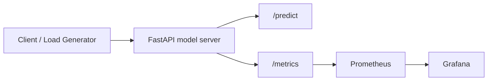

# ML Model Serving Observability

`ML Model Serving Observability` is a technical portfolio project that demonstrates how to expose a machine learning model through an inference API and monitor it with `Prometheus` and `Grafana`.

The repository combines:

- a reproducible model training pipeline;
- a `FastAPI` inference server;
- native Prometheus instrumentation;
- a pre-provisioned Grafana dashboard;
- a local development stack via `docker compose`.

## Problem Statement

Serving a model in production is only one part of the system. To operate an inference service safely, engineering teams usually need observability for:

- request throughput;
- latency percentiles;
- inference error rate;
- prediction distribution;
- confidence behavior over time;
- health and availability of the serving endpoint.

This project demonstrates an end-to-end reference architecture for that operational layer.

## Scope

This repository is deliberately optimized for `serving + observability` rather than model complexity. The central goal is to show how an ML inference service can be:

- packaged behind a typed API;
- instrumented with first-class runtime metrics;
- scraped by `Prometheus`;
- visualized through provisioned `Grafana` dashboards;
- executed locally in a reproducible stack.

## Architecture



### Runtime topology

The stack is composed of three deployable runtime units:

1. `model-api`
   inference service and metrics exporter
2. `prometheus`
   time-series scraper and query backend
3. `grafana`
   dashboarding and observability UI

## Repository Deliverables

- model training and artifact persistence in [src/model_training.py](src/model_training.py)
- instrumented serving layer in [src/serving.py](src/serving.py)
- technical inspection UI in [app.py](app.py)
- Docker image in [Dockerfile](Dockerfile)
- local observability stack in [docker-compose.yml](docker-compose.yml)
- Prometheus scrape config in [prometheus/prometheus.yml](prometheus/prometheus.yml)
- provisioned Grafana datasource and dashboard under [grafana](grafana)
- automated tests in [tests/test_serving.py](tests/test_serving.py)

## Execution Surfaces

The project exposes two complementary execution modes:

### 1. Application mode

The API is started directly with `uvicorn` and exposes:

- `/health`
- `/predict`
- `/metrics`

This mode is useful for local debugging, iterative development, and endpoint-level validation.

### 2. Full observability stack mode

The `docker compose` stack starts:

- the model server;
- the Prometheus collector;
- the Grafana dashboard layer.

This mode is useful for validating end-to-end telemetry and dashboard provisioning.

## Technical Stack

### Model and serving layer

- `scikit-learn`
- `pandas`
- `joblib`
- `FastAPI`
- `uvicorn`

### Observability layer

- `prometheus_client`
- `Prometheus`
- `Grafana`

### Runtime and packaging

- `Docker`
- `docker compose`
- `unittest`
- `Streamlit`

## Data and Artifact Lifecycle

The project persists generated runtime artifacts under `artifacts/`:

- serialized model: `wine_classifier.joblib`
- tabular training metrics: `training_metrics.csv`
- example request payloads: `sample_payload.csv`
- textual classification report: `classification_report.txt`

This artifact layout mirrors a lightweight model packaging workflow where training output is decoupled from the serving API code.

## Modeling Approach

The project uses the `wine` dataset from `scikit-learn` as a lightweight multi-class classification problem.

### Training pipeline

The training job:

1. loads the dataset;
2. splits it into `train` and `test`;
3. builds a `Pipeline(StandardScaler -> LogisticRegression)`;
4. evaluates `accuracy` and `macro_f1`;
5. persists:
   - the serialized model;
   - training metrics;
   - a sample payload for inference testing;
   - the text classification report.

### Training/serving boundary

The project keeps an explicit separation between:

- `model_training.py`
  offline artifact creation
- `serving.py`
  online inference and instrumentation

This split is important architecturally because it reflects the common production distinction between a `training pipeline` and an `inference plane`.

### Why this model

`LogisticRegression` is intentionally simple here because the goal is not state-of-the-art modeling, but rather a clean serving and observability reference.

It is a good fit for this repository because:

- it trains quickly;
- it provides calibrated-enough class probabilities for a demo setting;
- it integrates well with `StandardScaler`;
- it keeps failure analysis focused on serving behavior instead of model instability.

## Serving Layer

The inference service is implemented in [src/serving.py](src/serving.py).

### Exposed endpoints

- `GET /health`
  liveness and artifact availability
- `GET /metrics`
  Prometheus-compatible metrics endpoint
- `POST /predict`
  multi-class inference endpoint

### API semantics

#### `GET /health`

Acts as a liveness/readiness-style endpoint. It verifies that:

- the process is responsive;
- the model artifact path exists;
- the server can report serving metadata.

#### `GET /metrics`

Acts as the Prometheus scrape endpoint and exports the process-local telemetry registry in text exposition format.

#### `POST /predict`

Acts as the inference path and performs:

1. payload validation via `Pydantic`;
2. feature frame construction;
3. feature-name compatibility normalization;
4. `predict_proba` execution;
5. confidence extraction;
6. latency measurement;
7. metric emission.

### Inference contract

The `POST /predict` endpoint accepts a fully structured feature payload:

- `alcohol`
- `malic_acid`
- `ash`
- `alcalinity_of_ash`
- `magnesium`
- `total_phenols`
- `flavanoids`
- `nonflavanoid_phenols`
- `proanthocyanins`
- `color_intensity`
- `hue`
- `od280_od315_of_diluted_wines`
- `proline`

The response returns:

- `predicted_class`
- `confidence`
- `class_probabilities`
- `latency_ms`

### Input validation

The payload schema is strongly typed with `Pydantic`, and each numerical feature is guarded with `ge=0.0`. This gives the API a minimal but explicit contract and prevents malformed requests from reaching the model execution path.

## Prometheus Metrics

The API exports the following custom metrics:

- `model_inference_requests_total`
  total requests by endpoint and status
- `model_inference_latency_seconds`
  histogram for request latency
- `model_predictions_total`
  class distribution counter
- `model_prediction_confidence`
  confidence histogram
- `model_metadata`
  static metadata for the currently loaded model

### Metric semantics

#### `model_inference_requests_total{endpoint,status}`

Counter used for:

- throughput analysis;
- error-rate calculation;
- endpoint-level request accounting.

#### `model_inference_latency_seconds{endpoint}`

Histogram used for:

- latency SLI tracking;
- percentile estimation such as `p95`;
- alerting based on response-time degradation.

#### `model_predictions_total{predicted_class}`

Counter used for:

- class distribution monitoring;
- basic prediction-skew analysis;
- coarse output drift inspection.

#### `model_prediction_confidence`

Histogram used for:

- confidence distribution monitoring;
- threshold-analysis support;
- weak proxies for uncertainty shifts over time.

#### `model_metadata{model_name,dataset_name}`

Gauge used as a static metadata marker for the currently loaded serving artifact.

## Example PromQL Queries

Typical dashboard and alert queries for this stack:

```promql
sum(rate(model_inference_requests_total{status="success"}[5m]))
```

```promql
histogram_quantile(0.95, sum(rate(model_inference_latency_seconds_bucket[5m])) by (le))
```

```promql
sum(rate(model_inference_requests_total{status="error"}[5m]))
/
clamp_min(sum(rate(model_inference_requests_total[5m])), 0.0001)
```

```promql
sum by (predicted_class) (increase(model_predictions_total[15m]))
```

## Grafana Dashboard

The provisioned dashboard includes:

- inference throughput
- `p95` latency
- predicted class distribution
- error rate

This provides a compact but realistic operational lens for a model-serving API.

## Grafana Provisioning Model

The Grafana layer is provisioned from versioned files in the repository:

- datasource provisioning:
  [grafana/provisioning/datasources/prometheus.yml](grafana/provisioning/datasources/prometheus.yml)
- dashboard provider provisioning:
  [grafana/provisioning/dashboards/dashboard.yml](grafana/provisioning/dashboards/dashboard.yml)
- dashboard definition:
  [grafana/dashboards/model_serving_observability.json](grafana/dashboards/model_serving_observability.json)

This makes the observability layer declarative and reproducible instead of relying on manual dashboard creation.

## Current Training Results

Output from [main.py](main.py):

```text
ML Model Serving Observability
-------------------------------------
dataset_name: wine
features: 13
classes: 3
train_rows: 133
test_rows: 45
accuracy: 1.0
macro_f1: 1.0
```

### Correct interpretation

- the dataset is small and well-behaved;
- the project is optimized for observability demonstration, not benchmark difficulty;
- the current scores validate the serving stack and metric instrumentation rather than claiming production performance.

## Failure Modes Covered By The Implementation

The current implementation explicitly handles or exposes:

- invalid payload structure via API validation;
- feature-name mismatch between serving contract and training schema;
- serving exceptions as `500 prediction_failed`;
- error counting through Prometheus labels;
- latency observation on both success and failure paths.

## Streamlit Interface

The technical app in [app.py](app.py) shows:

- model training metrics;
- example payloads for `/predict`;
- instrumentation inventory for Prometheus scraping.

The Streamlit layer is not the primary serving surface. It is an engineering inspection console for:

- checking training outputs;
- validating payload shape;
- communicating observability coverage to reviewers.

## Local Execution

### Python mode

```bash
python3 -m venv .venv
source .venv/bin/activate
pip install -r requirements.txt
python3 main.py
uvicorn src.serving:app --host 0.0.0.0 --port 8000
streamlit run app.py
```

### Docker mode

```bash
docker compose up --build
```

Expected services:

- API: `http://localhost:8000`
- Prometheus: `http://localhost:9090`
- Grafana: `http://localhost:3000`

Grafana default credentials:

- user: `admin`
- password: `admin`

## Example Request

```bash
curl -X POST http://localhost:8000/predict \
  -H "Content-Type: application/json" \
  -d '{
    "alcohol": 14.23,
    "malic_acid": 1.71,
    "ash": 2.43,
    "alcalinity_of_ash": 15.6,
    "magnesium": 127.0,
    "total_phenols": 2.8,
    "flavanoids": 3.06,
    "nonflavanoid_phenols": 0.28,
    "proanthocyanins": 2.29,
    "color_intensity": 5.64,
    "hue": 1.04,
    "od280_od315_of_diluted_wines": 3.92,
    "proline": 1065.0
  }'
```

## Tests

```bash
python3 -m unittest discover -s tests -v
```

The tests cover:

- health endpoint availability;
- prediction endpoint behavior;
- metrics endpoint exposure.

## Observability Design Notes

From an SRE/MLOps perspective, this repository demonstrates a few important design choices:

- metrics are emitted inside the request lifecycle, not through ad hoc logging only;
- the API exposes a first-class `/metrics` endpoint rather than relying on sidecar scraping hacks;
- percentile-friendly latency measurement uses a histogram, not a gauge;
- dashboard provisioning is version-controlled;
- the stack can be reproduced locally with no manual Grafana configuration.

## Production Evolution Path

Natural next steps for a more advanced version:

- request authentication and rate limiting;
- structured JSON logging;
- tracing with OpenTelemetry;
- feature drift monitoring;
- model version routing;
- error budget alerts and SLOs;
- canary deployment of model versions;
- load generation for synthetic traffic.

## Technical Positioning

This project should be read as a `reference implementation for observable ML inference services`.

Its strongest portfolio value is not model novelty, but rather the fact that it demonstrates:

- model artifact generation;
- inference endpoint design;
- runtime telemetry instrumentation;
- Prometheus integration;
- Grafana dashboard provisioning;
- local reproducibility through container orchestration.

## Why This Project Is Useful In A Portfolio

This repository demonstrates practical experience with:

- ML model packaging;
- inference API design;
- Prometheus-based instrumentation;
- Grafana dashboard provisioning;
- local observability stack design with Docker;
- operational thinking around ML serving.
